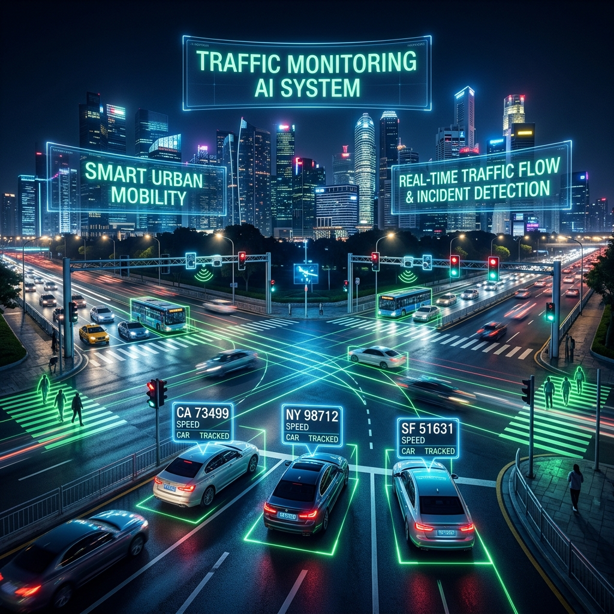

# RedLight AI | Hệ Thống Phát Hiện Xe Vượt Đèn Đỏ & Nhận Diện Biển Số



## 📋 Giới thiệu dự án
**RedLight AI** là một hệ thống giám sát giao thông thông minh được xây dựng trên nền tảng AI hiện đại. Hệ thống tự động phân tích luồng video (file hoặc stream RTSP) để phát hiện hành vi vượt đèn đỏ và trích xuất biển số xe vi phạm với độ chính xác cao.

Phiên bản hiện tại đã được nâng cấp lên kiến trúc **Production-ready**, hỗ trợ xử lý hàng đợi phân tán và cơ sở dữ liệu mạnh mẽ.

---

## ✨ Tính năng nổi bật
- 🎥 **Đa dạng nguồn vào**: Hỗ trợ Upload Video và kết nối trực tiếp với **Camera IP (RTSP)**.
- 🤖 **AI Core**: Sử dụng **YOLOv8** để phát hiện phương tiện và **ByteTrack** để theo dõi hành trình.
- 🚦 **State Machine Logic**: Theo dõi hành trình xe qua các vùng (Waiting Zone ➔ Violation Zone) để loại bỏ báo động giả.
- 🆔 **LPR (License Plate Recognition)**: Tự động trích xuất biển số xe vi phạm ngay cả trong điều kiện phức tạp.
- 🌓 **Giao diện hiện đại**: UI Dark Mode với hiệu ứng Glassmorphism, Responsive hoàn toàn trên di động.
- ⚡ **Xử lý phân tán**: Tích hợp **Celery & Redis** để quản lý hàng đợi, không block server khi xử lý video nặng.
- 📊 **Quản lý tập trung**: Dashboard tra cứu vi phạm, quản lý camera và xem lại lịch sử bằng chứng.

---

## 🏗️ Kiến trúc hệ thống
Hệ thống được thiết kế theo mô hình Microservices-ready:
- **Web App**: Flask (Python) xử lý giao diện và API.
- **Task Queue**: Celery quản lý các tác vụ xử lý AI chạy ngầm.
- **Message Broker**: Redis trung chuyển dữ liệu giữa Web và Worker.
- **Database**: PostgreSQL (Production) hoặc SQLite (Development).
- **AI Worker**: Chạy các thuật toán Computer Vision (OpenCV, Torch).

---

## 🛠️ Hướng dẫn cài đặt nhanh với Docker

Đây là cách nhanh nhất để triển khai toàn bộ hệ thống (Web, DB, Redis, Worker).

### Yêu cầu:
- Đã cài đặt **Docker** và **Docker Compose**.

### Các bước thực hiện:
1. Clone dự án:
   ```bash
   git clone https://github.com/your-username/Web_NhanDienXe.git
   cd Web_NhanDienXe
   ```
2. Khởi chạy hệ thống:
   ```bash
   docker-compose up -d --build
   ```
3. Truy cập hệ thống tại: `http://localhost:5000`

---

## 💻 Cài đặt thủ công (Local Development)

Nếu bạn muốn chạy trực tiếp trên máy để phát triển:

1. **Khởi tạo môi trường:**
   ```bash
   python -m venv venv
   venv\Scripts\activate  # Windows
   pip install -r requirements.txt
   ```
2. **Cài đặt Redis:** Đảm bảo Redis đang chạy tại `localhost:6379`.
3. **Chạy ứng dụng:**
   - Mở terminal 1 (Web): `python app.py`
   - Mở terminal 2 (Worker): `celery -A celery_tasks.celery_app worker --loglevel=info`

---

## 📂 Cấu trúc thư mục
```
Web_NhanDienXe/
├── app.py                 # Flask Server & API Routes
├── celery_tasks.py        # Định nghĩa các task xử lý AI ngầm
├── video_processor.py     # Logic cốt lõi: State Machine & OpenCV
├── detector_manager.py    # Điều phối các model AI (YOLO, OCR)
├── database.py            # Quản lý CSDL (Postgres/SQLite)
├── config.py              # Cấu hình hệ thống & Environment
├── templates/             # Giao diện Jinja2 (HTML)
├── static/                # CSS, JS, Images & Build files
├── Dockerfile             # Cấu hình build container
└── docker-compose.yml     # Điều phối các dịch vụ hệ thống
```

---

## 📡 API Endpoints chính
- `GET /api/videos`: Liệt kê các video đã upload.
- `POST /api/upload`: Upload file video mới.
- `POST /api/process/<filename>`: Đẩy video vào hàng đợi xử lý.
- `GET /status/<job_id>`: Kiểm tra tiến độ xử lý từ Celery.
- `GET /cameras`: Quản lý danh sách Camera IP.
- `GET /api/search?plate=...`: Tra cứu vi phạm theo biển số.

---

## 🛡️ License & Copyright
Dự án được phát triển nhằm mục đích nghiên cứu và ứng dụng AI vào an toàn giao thông.
© 2025 **RedLight AI Team**. Phát triển bởi AI Assistant (Antigravity).
MIT License.
